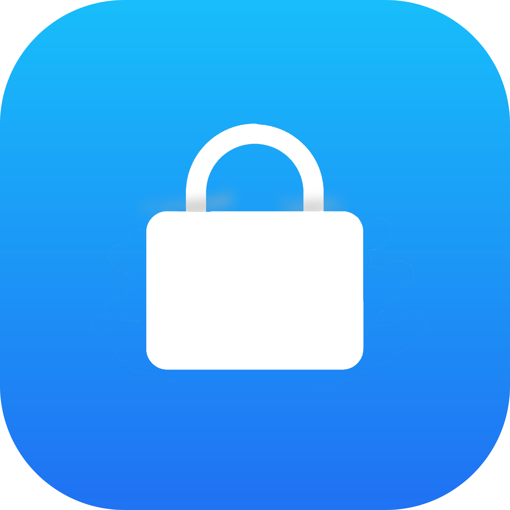

# Jaility
Simple iOS supercharger to be used with TrollStore. Can be used to disable locking after respring, supervise your Device in one click, change badge colours and make your password keys blank. Also respring your Device on any iOS version even if you are on iOS 16!

# Warning
If you used disable lock after respring, and want to enable it back but the enable lock after respring button doesn't work, you need to go to /var/Managed Preferences/mobile and edit the key in com.apple.springboard.plist named SBDontLockAfterCrash to false. If blank password keys doesn't work, try setting your phone's language to English (US) and turning the bold text off if it's on, and then try again. Should work. Also, the app doesn't work on iOS 14 and lower!

# Installing
Download the latest .iPA file from Releases tab and import it to TrollStore. That's it. :)

# Compiling
To compile this you need to download the ZIPFoundation framework and create a new folder called "Submodules" and then drop the ZIPFoundation framework stuff into the source folder. Then link it in Xcode as a group. To build the .iPA so it can be used with TrollStore you need to install ldid and modify the build.command a bit, then run it in the terminal.

# Credits
The Respring Project by Amy, RedDot Project by s8ngyu, fiore for UI insporation and all of my testers. :)
